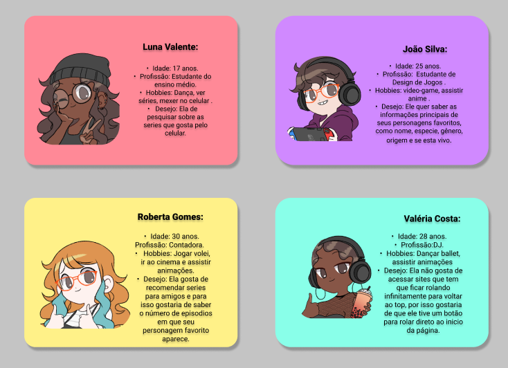
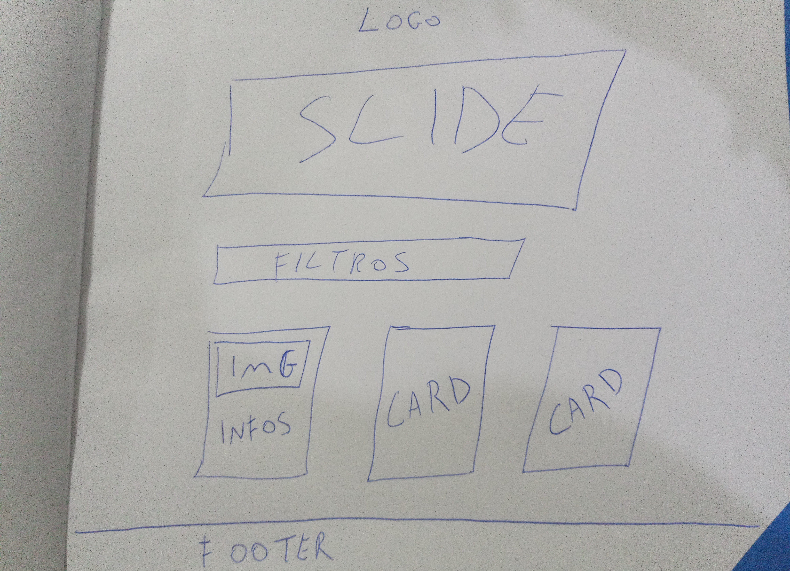

# Data Lovers

## Índice

- [1. Resumo do projeto] (#1-resumo-do-projeto)
- [2. Definição de produto] (#2- Definição de produto)
- [3. Objetivos de aprendizagem] (#3- Objetivos de aprendizagem)
- [4. História do usuário] (#4- História do usuário)
- [5. Design] (#4- Design)
- [6. Teste de usabilidade] (#5- Teste de usabilidade)
- [7. Linguagens utilizadas](#6- Linguagens utilizadas)
- [8. Criadoras](#7- Criadoras)

---

## 1. Resumo do projeto

---

## 2. Definição de produto

---

## 3. Objetivos de aprendizagem

---

### HTML

- [ ] **Uso de HTML semântico**

### CSS

- [ ] **Uso de seletores de CSS**

- [ ] **Empregar o modelo de caixa (box model): borda, margem, preenchimento**

- [ ] **Uso de flexbox en CSS**

### Web APIs

- [ ] **Uso de seletores de DOM**

- [ ] **Gerenciamento de eventos de DOM**

- [ ] **Manipulação dinâmica de DOM**

### JavaScript

- [ ] **Diferenciar entre tipos de dados primitivos e não primitivos**

- [ ] **Manipular arrays (filter, map, sort, reduce)**

- [ ] **Manipular objects (key | value)**

- [ ] **Variáveis (declaração, atribuição, escopo)**

- [ ] **Uso de condicionais (if-else, switch, operador ternário)**

- [ ] **Uso de laços (for, for..of, while)**

- [ ] **Uso de funções (parâmetros, argumentos, valor de retorno)**

- [ ] **Testes unitários**
- [ ] **Uso ES modules**

- [ ] **Uso de linter (ESLINT)**

- [ ] **Uso de identificadores descritivos (Nomenclatura | Semântica)**

- [ ] **Diferença entre expression e statements**

### Git e GitHub

- [ ] **Git: Instalação e configuração**

- [ ] **Git: Controle de versão com git (init, clone, add, commit, status, push, pull, remote)**

- [ ] **Git: Integração de mudanças entre ramos (branch, checkout, fetch, merge, reset, rebase, tag)**

- [ ] **GitHub: Criação de contas e repositórios, configuração de chave SSH**

- [ ] **GitHub: Implantação com GitHub Pages**

- [ ] **GitHub: Colaboração pelo Github (branches | forks | pull requests | code review | tags)**

### user-centricity

- [ ] **Desenhar a aplicação pensando e entendendo a usuária**

### product-design

- [ ] **Criar protótipos para obter feedback e iterar**

- [ ] **Aplicar os princípios de desenho visual (contraste, alinhamento, hierarquia)**

### research

- [ ] **Planejar e executar testes de usabilidade**

---

## 4. História do usuário

 
Nós escolhemos 4 usuários para trabalhar em nosso web site:
 

 

## 
 Com base neles conseguimos visualizar bem que seria necessário para atender as necessidades deles e desenhar o layout da página.
 

## 5. Design

---

### Desenho de interface do usuário

#### Protótipo de baixa fidelidade

 Começamos fazendo um desenho a mão para ter um ponto de partida e ter uma ideia de por onde começar...
 

 

#### Protótipo de alta fidelidade

---

## 6.Teste de usabilidade

---

## 7. 💻 Linguagens utilizadas

<article>

 

 

 

   </article>

---

### 8. Criadoras

<table>
  <tr>
    <td align="center">
      <a href="https://github.com/Marione-Tainara">
           
  
          <b>Marione Pereira</b>
        
      </a>
    </td>
    <td align="center">
      <a href="https://github.com/juliabb">
   
             
          <b>Julia Benedicto</b>
        
      </a>
    </td>
  </tr>
</table>
